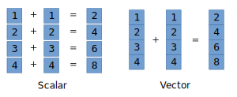
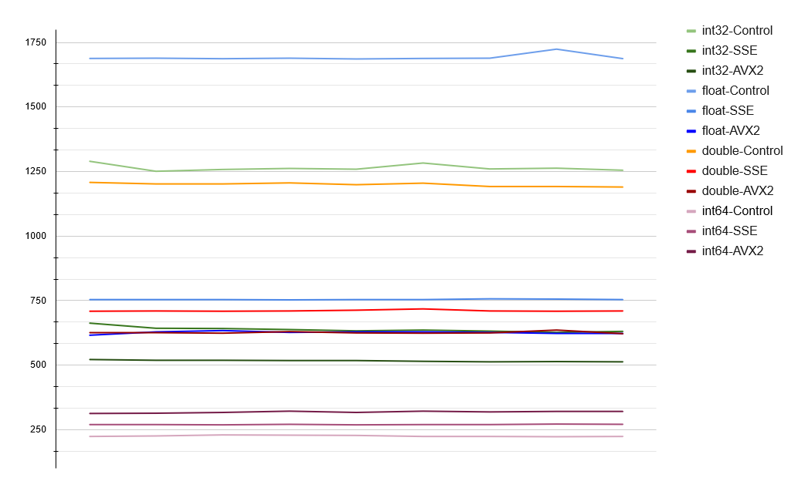
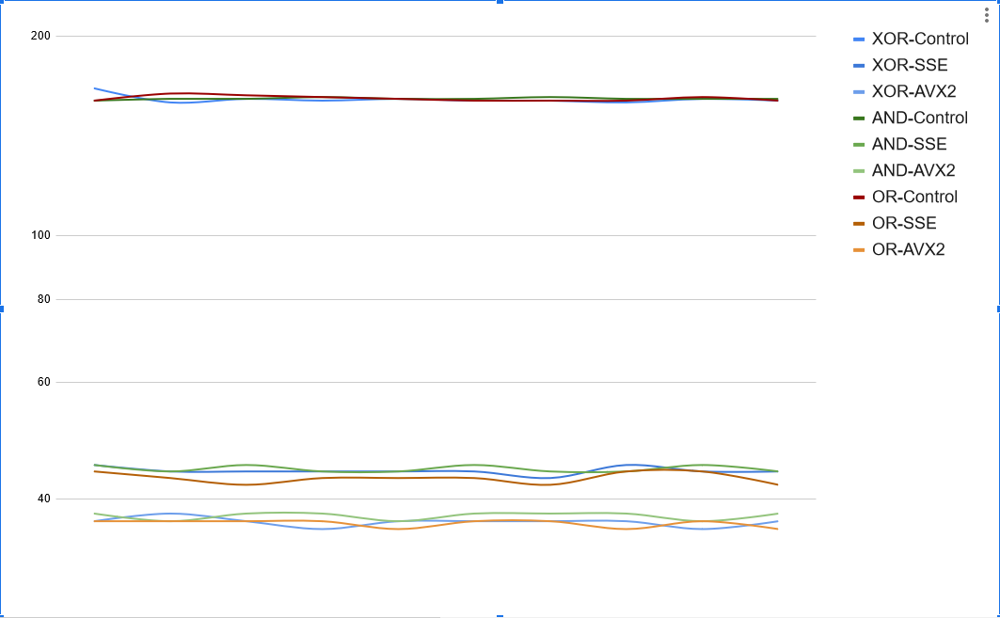

# SSE2+ and AVX2 fun time
Many developers avoid using SIMD intrinsics, so I'm gonna make some fun tests here

The reason why SIMD is faster is that you perform an operation on multiple data at once:

## Math test

Note: This test is accurate for comparing a single type of operation to it's SIMD and non-SIMD version.
So, you can tell that AVX2 version of float matrix test is faster than SSE2, but you can not compare it to big int group, because they invoke completely different operations.

TL:DR AVX2 is ~30% faster for math than SSE2, and ~3X faster than non-SIMD runs

## Bitwise Operations

### Benchmark
Benchmark consists of 100 runs of 100 000 XOR ops on 256-bit buffers.

This test was conducted on a single core of AMD R5 3600 at stock clock speed.

Without use of any intrinsics it takes ~400ms to complete 100 000 XOR ops.

AVX hovers around 100ms for the same amount of work but gets beaten by the SSE implementation. Which is interesting, considering that I had to divide 256-bit test buffer into two 128-bit vectors. It is probably caused by the fact that I'm using an AMD CPU.

A bit more diverse test reveals that such a result is also true for other bit operations. What is interesting, is that control runs show less fluctuations than SIMD-accelerated ones.

But anyway, SIMD makes everything run in orders of magnitude faster, so that's cool.

# Articles about CPU intrinsics

<https://chryswoods.com/vector_c++/emmintrin.html>

<https://chryswoods.com/vector_c++/immintrin.html>

<https://chryswoods.com/vector_c++/portable.html>

<https://www.codeproject.com/Articles/874396/Crunching-Numbers-with-AVX-and-AVX>
