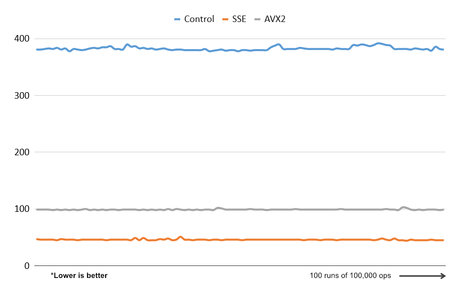

# simd
Many developers avoid using SIMD intrinsics, so I'm gonna make some fun tests here

## XOR

### Benchmark
Benchmark consists of 100 runs of 100 000 XOR ops on 256-bit buffers.

This test was conducted on a single core of AND R5 3600 at stock clock speed.

Without use of any intrinsics it takes ~400ms to complete 100 000 XOR ops.

AVX hovers around 100ms for the same amount of work but gets beaten by the SSE implementation. Which is interesting, considering that I had to divide 256-bit test buffer into two 128-bit vectors. It is probably caused by the fact that I'm using an AMD CPU.

